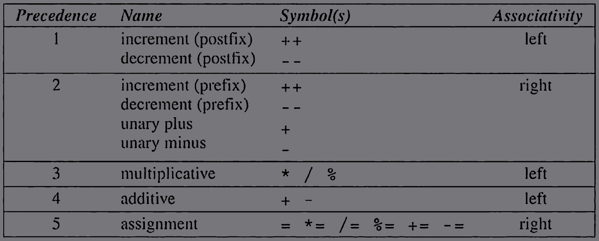

# Topics Covered
- [&check;] [4.1 Arithmetic Operators](#41-arithmetic-operators)
- [&check;] [4.2 Assignment Operators](#42-assignment-operators)
- [&check;] [4.3 Increment and Decrement operators](#43-increment-and-decrement-operators)
- [&check;] [4.4 Expression Evaluation](#44-expression-evaluation)
- [&check;] [4.5 Expression Statements](#45-expression-statements)
- [&cross;] [Q/A, Exercises, Projects](#)

<hr>

# 4.1 Arithmetic Operators
| Unary                                                                                              | Binary                                                                                                                                                                                         |
| -------------------------------------------------------------------------------------------------- | ---------------------------------------------------------------------------------------------------------------------------------------------------------------------------------------------- |
| <table> <tbody><tr><td> + (unary plus)</td></tr> <tr><td>- (unary minus)</td></tr></tbody></table> | <table> <thead> <tr> <th>Additive</th><th> Multiplicative </th> </tr> </thead> <tbody><tr><td>-</td><td>*</td></tr> <tr><td>+</td><td>/</td></tr> <tr><td></td><td>%</td></tr></tbody></table> |

## Operator precedence and Associativity
1. `+ and -` (unary)  
2. `* / %`
3. `+ and -` (binary)

where, precedence increases from `1` to `3` 

| Expression | Equivalent to      |
| ---------- | ------------------ |
| i + j * k  | i + ( j * k )      |
| - i * - j  | ( - i ) * ( - j )  |
| +i + j / k | ( +i ) + ( j / k ) |

**Associativity Rule** applies when there are multiple operators of same precedence level in a single expression

- **Right associative (R to L)** : ` + - * / %`
- **Left associative (L to R)** : ` + and -` *(Unary)*


# 4.2 Assignment Operators
when `e` is assigned to `v` (i,e, `v = e`), then first the expression `e` (can be a constant, variable or more complicated expression) is evaluated, then its value is copied to `v`.  
If the types are not same then there would be an attempt to convert implicitly.  
Since `=` is an operator it can be chained.

eg.
```c
int i;
float j;

//an example of (chained `=` op and implicit coversion)
j = i = 33.3f;
// i = 33, j = 33.0
```

## Side Effects
>We don’t normally expect operators to modify their operands, since operators in
mathematics don't. Writing `i + j` doesn’t modify either `i` or `j` ; it simply computes the result of adding `i` and `j`.  
Most C operators don’t modify their operands, but some do. We say that these operators have side effects, since they do more than just compute a value. 
> 
>Eg. assignment operators `++` and `--` have
side effects: they modify the values of their operands. Evaluating the expression
`++i` (a “pre-increment”) yields `i + 1` and— as a side effect— increments `i`

## Lvalues
An object stored in computer memory, not a constant or result of a computation.
> The assignment operator requires an ***lvalues*** as its left operand.

- 34 = i;
- -i = j;
- (a + b) = c;  
are all **Invalid** statements (requires an *lvalue* to the LHS)

## Compound Assignment 
`-=`, `+=`, `*=`, `/=`, `%=` are some compound assignment operators

```c
a += b; //a = a + b;
```
>NOTE: for `v += e`, `e` cannot be any experession. One problem is operator precedence. Eg. `i *= j + k` isn't the same as `i = i * j + k`


# 4.3 Increment and Decrement operators
- `postfix-` a++, a-- (left associative, higher precedence than unary op)
- `prefix-` ++b, --b (right associative, same precedence as unary op)
```c
int i = 1;
int j = 2;
k = ++i + j++;
/* Order of evaluation-
i = i + 1, so i = 2
k = i + j, so k = 4
j = j + 1, so j = 3
*/

int a = 1;
int b = 2;
c = a++ + b++;
// a = 2, b = 3, c = 3
```
> NOTE:   
> These experssions are `UB` (Undefined Behaviour)- 
> ```c
> c = (a++) + (++a); // UB
> printf("%d",a++,a); // UB
> foo(++a, a++) //UB
> ```
> compiler dont know what expression to execute first, hence a `UB`  
> More about `UB`- https://en.cppreference.com/w/cpp/language/eval_order
<hr>

# 4.4 Expression Evaluation

### Precedence Table and some examples- 



| Expression    | Equivalent to             | Associativity |
| ------------- | ------------------------- | ------------- |
| i / j * k     | ( i / j ) * k             | L to R        |
| i - j + k     | ( i - j ) + k             | L to R        |
| - + j         | - ( +j )                  | R to L        |
| i = j = k = 0 | ( i = ( j = ( k = 0 ) ) ) | R to L        |
| i += j += k   | ( i += ( j += k ) )       | R to L        |

Lets say, we have an expression-  
`a = b += c++  - d  + --e / -f`  
As per the precedence table, we can break this complex expression into subexpression, below are the steps- 
1. `a = b += (c++) - d + --e / -f`  (postfix op having the highest precedence)
2. `a = b += (c++) - d + (--e) / (-f)` (unary and prefix op having the same precedence)
3. `a = b += (c++) - d + ((--e) / (-f))`
4. `a = b += ((c++) - d) + ((--e) / (-f))` (left associativity between `+` and `-`)
5. `a = b += (((c++) - d) + ((--e) / (-f)))`
6. `a = (b += (((c++) - d) + ((--e) / (-f))))` (left associativity of `=` and `+=`)
7. `(a = (b += (((c++) - d) + ((--e) / (-f)))))`  

A fully paranthesized expression

## Order of subexpression evaluation
C doesn't define the order in which the subexpressions are evaluated (except subexpressions involving logical *and*, logical *or*, conditional and comma operators).  
Eg. In the expression `(a+b)*(c+d)`, we dont know whether `(a+b)` will be executed before `(c-d)`

The output/result however would remain same, until there is a case where the subexpression is modifying one of its operands (that case would be a `UB`).  
- Example 1.   
    ```c
    a = 5;
    c = (b = a + 2) - (a = 1); //UB; because, `c` can either be 6 or 2, depending on which subexpession is executed first
    ```
    evaluating `(a = 1)` would give an "Undefined Behaviour"(`UB`), because `a` was already an operand in the subexpression `(b = a + 2)` and at the same time value of `a` is trying to be changed from subexpression `(a = 1)` 

- Example 2.  
    ```c
    i = 2;
    j = i * i++; //UB; because one subexpression is modifying the operand `i`
    ```

# 4.5 Expression Statements
C has an unusual rule that any expression can be used as a statement.  
Eg.  
```c
++i; //is a statement, meaningful (as it has 'side effect')
```
`++i` is an expression whose value if not stored in any variable, will be discarded, but it is useful statement, becasue as a *side effect* the expression is incrementing the original value of `i`.

Eg.
```c
i * j - 1; // meaningless statement (as is has no 'side effects', i.e, the value of 'i' or 'j' is not changed)
```